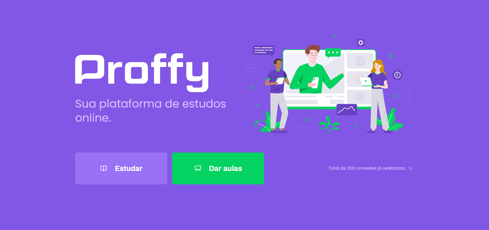

  

 

  <a href="README.md">Português</a>
  ·
  <a href="README-en.md">English</a>

<h4 align="center">
    An online study platform that connects students with teachers!
<h4>

    <a href="#-notes">Notes</a>&nbsp;&nbsp;&nbsp;|&nbsp;&nbsp;&nbsp;
    <a href="#-version-2.0">Version 2.0</a>&nbsp;&nbsp;&nbsp;|&nbsp;&nbsp;&nbsp;
    <a href="#-technology">Technology</a>&nbsp;&nbsp;&nbsp;|&nbsp;&nbsp;&nbsp;
    <a href="#-getting-started">Getting Started</a>&nbsp;&nbsp;&nbsp;|&nbsp;&nbsp;&nbsp;
    <a href="#-how-to-contribute">How to contribute</a>&nbsp;&nbsp;&nbsp;|&nbsp;&nbsp;&nbsp;
    <a href="#-license">License</a>

## 📑 Notes

- [Notion](https://www.notion.so/zehguilherme/Next-Level-Week-2-fe323580c8804c98a874114fb3f3eeaa)
- [Whimsical](https://whimsical.com/G1Kf6yE5pWbPbxvdowmgZv@LUSUr8hW5owjZywGDt)

## 🔜 Version 2.0

- [Notion](https://www.notion.so/Vers-o-2-0-Proffy-eefca1b981694cd0a895613bc6235970)

## 🚀 Technology

### Web

- [ReactJS](https://pt-br.reactjs.org/)
- [TypeScript](https://www.typescriptlang.org/)
- [React Router DOM](https://reactrouter.com/web/guides/quick-start) - Pagination
- [Axios](https://github.com/axios/axios) - Facilitates consumption of external APIs

### Server

- [NodeJS](https://nodejs.org/pt-br/)
- [TypeScript](https://www.typescriptlang.org/)
- [ts-node-dev](https://www.npmjs.com/package/ts-node-dev) - Performs and observes changes in the API
- [Express](https://expressjs.com/) - Microframework
- [SQLite](https://www.sqlite.org/index.html) - Database
- [Knex](http://knexjs.org/) - Query Builder
- [CORS](https://developer.mozilla.org/pt-BR/docs/Web/HTTP/Controle_Acesso_CORS) - Allows different addresses to access the API
  - **Default:** Only applications from the same address can access it

### Mobile

- [React Native](https://reactnative.dev/)
- [Expo](https://expo.io/)
- [Expo Google Fonts](https://github.com/expo/google-fonts)
- [Expo AsyncStorage](https://docs.expo.io/versions/latest/sdk/async-storage/) - API de armazenamento
- [Feather Icons](https://feathericons.com/) - Icon pack
- [React Navigation](https://reactnavigation.org/) - Navigation / Route creation and management
- [Axios](https://github.com/axios/axios) - Facilitates consumption of external APIs
  - Stack
  - Bottom Tabs

## ⌛ Getting Started

First of all you need to have `node` and `yarn`(or `npm`) installed on your machine.

_If you decide to use npm don't forget to delete yarn.lock in folders_

Then you can clone the repository.

`git clone https://github.com/zehguilherme/next-level-week-2`

First start the application backend.

1. `cd backend`
2. `yarn` or `npm install`
3. `yarn dev` or `npm run dev`

Now starting the web application.

1. `cd frontend`
2. `yarn` or `npm install`
3. `yarn start` or `npm run start`

Starting the application with Expo.

1. `cd mobile`
2. `yarn` or `npm install`
3. `yarn start` or `npm run start`
4. Press on `Run on Android device/emulator` or `Run on iOS simulator`
5. Another option is to install Expo on your phone and scan the QRCode.

_For the api to work on the cell phone, change the fields that have a fixed IP to your own IP_

## 🤔 How to contribute

1. Faça um fork desse repositório;
2. Crie uma branch com a sua feature: `git checkout -b minha-feature`;
3. Faça commit das suas alterações: `git commit -m 'feat: Minha nova feature'`;
4. Faça push para a sua branch: `git push origin minha-feature`;
5. Crie um pull request;
6. Depois que o merge da sua pull request for feito, você pode deletar a sua branch.

## 📝 License

This project is under the MIT license. See the [LICENSE](LICENSE) for more information.

---

Made with 💟 by José Guilherme Paro Monteiro Tomaine 👋 [Talk to me!](https://www.linkedin.com/in/jos%C3%A9-guilherme-paro-monteiro-tomaine/)
